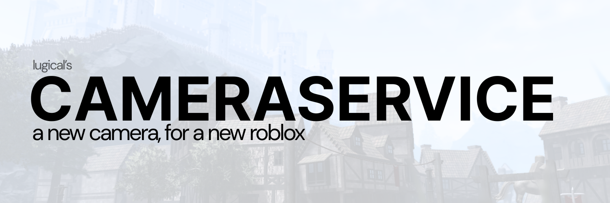

# Introduction

**CameraService** is *the* open-sourced, fully customizable alternative to Roblox's game camera system, downloaded and used by **1,000+** developers. Supported on all devices, CameraService introduces new features to reach the next level of immersion, from *smooth* camera motion and shaking, to 2D game cameras with axis-locking, and other spatial camera effects.

## The Features
The list of features goes on and on, some of which include:

- Different, customizable properties that developers can play around with and implement, including the camera's smoothness, zoom, offset from the part it's focusing on, and more.
- Seamlessly transitioning between different camera views (first-person, third-person, shift-lock, etc.), and letting you create your own!
- Smooth camera movements, rather than Roblox's usual instantaneous movements, using linear interpolation and damping.
- The ability to tilt the camera with ease, opening the door to advanced-like camera manipulation to beginners.
- Properties that let you enable aesthetically appealing effects on the player's character, such as having their body follow the mouse.
- Shaking camera effects that can be used for a multitude of purposes.
- Avatar-aware wobbling that gives that extra kick of realism.
- Ability to lock camera panning on the X and Y axes.
- Compatible on all devices, including the laptop, phone, tablet, and console.

## Quick Example
Say you wanted to recreate the cinematic camera effect seen at the very top and in demonstrations. To create something like that, your program would look like:

```lua
local CameraService = require(script.Parent.WhereverThisIsPlaced.ShouldBeOnTheClient)
local information = {
	Smoothness = 10,
	CharacterVisibility = "All",
	MinZoom = 10,
	MaxZoom = 10, 
	Zoom = 10,
	AlignChar = false,
	Offset = CFrame.new(),
	LockMouse = false,
	BodyFollow = false,
	Wobble = 3
}

CameraService:CreateNewCameraView("Cinematic", information)
CameraService:SetCameraView("Cinematic") --> Tada!
CameraService:ChangeFOV(90, false) --> You could also add a bit more with changing the FOV.
```

And let's say you wanted you wanted to just simply have players start in CameraService's first-person when they join. It's simply a matter of just a couple lines.
```lua
local CameraService = require(script.Parent.WhereverThisIsPlaced.ShouldBeOnTheClient)
CameraService:SetCameraView("FirstPerson")
--> Other built-in camera views include: FirstPerson, FirstPersonVariant, Cinematic, and ShiftLock

--> And if we wanted to spice it up, and have it feel like an explosion?
--> When the character steps on a certain part, it can go like this:
local player = game.Players.LocalPlayer
local debounce = false
workspace.ExplosionPart.Touched:Connect(function(hit)
    if not debounce and hit and player and player.Character and hit.Parent == player.Character then
         debounce = true 
         CameraService:Shake(1, 5) --> Shakes heavily for 5 seconds.
    end
end)

```
## Next Steps

- Follow the **[Installation guide](./installation.md)** to drop the module into your game.
- Browse the **[built-in views](./built-in-views.md)** to see what ships out of the box.
- Skim the **[examples](./examples.md)** for drop-in recipes.
- Dig into the **[API Reference](/api/CameraService)** for every property and method.

:::note Where to Place CameraService
For best practices, place CameraService somewhere on the client-side, preferably within the `StarterPlayerScripts` container.
:::